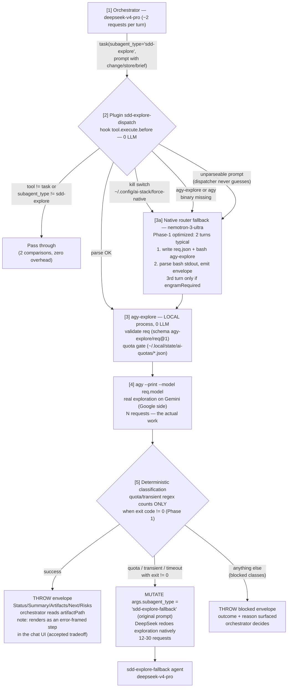

# sdd-explore request flow (current)

Mermaid diagram of one routed SDD exploration with the dispatcher plugin active
(Phase 1 optimizations + Phase 2 0-LLM dispatcher). Rendered from verified
code paths — `src/agy/dispatch-core.ts`, `src/agy/outcomes.ts`, and the
`tool.execute.before` hook contract.

## Per-path request cost

| Path | Before (LLM router) | Now (dispatcher) |
|---|---|---|
| Happy (dispatch success) | 2 DeepSeek + **3-4 Nemotron** + N Gemini | 2 DeepSeek + **0 router** + N Gemini |
| Degraded (ambiguous prompt / kill switch / missing binary) | — | 2 DeepSeek + 2 Nemotron + N Gemini |
| Real fallback (quota exhausted, exit != 0) | 2 + 3-4 Nemotron + 12-30 DeepSeek | 2 + 0 router + 12-30 DeepSeek |
| False fallback from log noise | happened (2026-08-24, metrics #9) | impossible — exit code corroborates |

## Escape hatches (all land on the optimized native router, never worse)

1. Kill switch: `touch ~/.config/ai-stack/force-native` (same file the CLI checks).
2. Binary preflight: dispatcher verifies `agy-explore` and `agy` exist before dispatching.
3. Parse ambiguity: no backticked change name, conflicting names, or unparseable
   prose falls through to the native 2-turn router — the dispatcher never guesses.

## Known gaps

- Engram persistence (`sdd/{change}/explore` mem_save) was done by the LLM router;
  the plugin has no MCP access, so the envelope reports it as PENDING with the
  workdir artifact path. Follow-up: fold the engram write into `agy-explore`.
- gentle-ai prompt drift lowers the dispatch rate silently — check the plugin's
  debug logs (`client.app.log`) if dispatched runs stop appearing.
