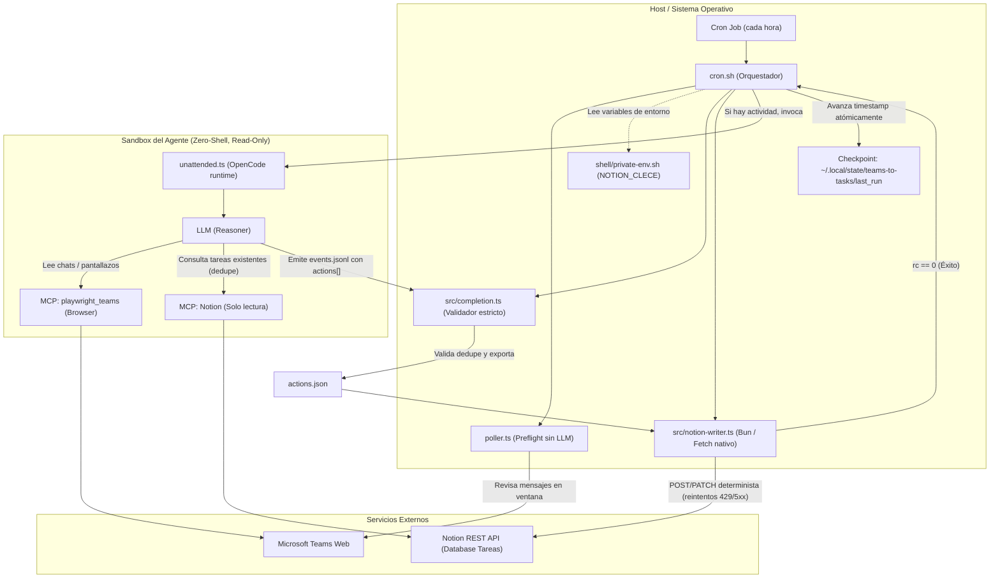
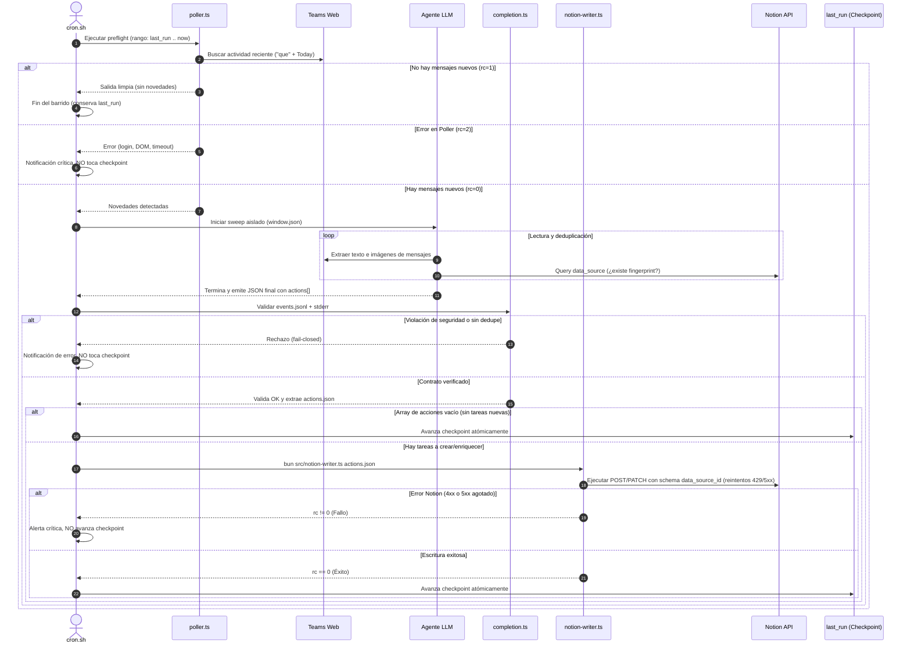

# Teams → Tareas (teams-to-tasks)

Lee Microsoft Teams web mediante un Chromium con perfil persistente (MCP `playwright_teams`) y convierte mensajes en tareas de la base de datos **Tareas** de Notion personal.

## Reliable unattended completion

The scheduled reader now fails closed: process exit zero is necessary but NOT
sufficient for success. Only a final assistant JSON result bound to this run's
exact window, followed by a terminal `stop` event, can authorize a checkpoint
commit. The agent is strictly read-only: it queries Notion to deduplicate
and emits planned actions in its JSON result. Direct Notion write tool calls are
forbidden and rejected by the validator. The host (`cron.sh`) then invokes
`src/notion-writer.ts` to execute validated actions with retry and strict schemas.
Any tool error, permission rejection, expired session, missing/malformed
result, or interrupted stream preserves the checkpoint — with one deliberate,
revertable allowance: a `playwright_teams_browser_*` tool failing with a stale
snapshot reference (`Ref ... not found in the current page snapshot`) is
tolerated only when a LATER call to the SAME tool completes successfully
(recovery evidence observed in live sweeps). Everything else fails closed:
permission/`teams_read` denials, Notion errors, unknown tools. Revert by
removing `recoveredStaleRef` in `src/completion.ts`.

- `unattended.json`, `unattended.md`, `unattended.ts`: dedicated default-deny
  agent, isolated HOME/config, no interactive plugins or inherited project rules.
  Model/variant and provider configuration come from the user's selected default
  agent; this subsystem never chooses a replacement model. Provider auth plugins
  are not loaded; if required, the run fails rather than enabling more plugins.
- The wrapper supplies local time, timezone/offset and UTC window boundaries.
  No shell, delegation, browser JavaScript, permission repair, database bootstrap
  or memory writes are available to the unattended agent. Teams navigation/search
  remains read-only by instruction; generic click/type tools are NOT a sandbox
  against a malicious model. Screenshots can only be read from the run directory.
- `read`/`external_directory` are allowed for exactly two run-scoped roots:
  the run's screenshot directory and its isolated `XDG_DATA_HOME` (where
  OpenCode pages large tool output under `opencode/tool-output/<id>`; falling
  back to the real user's `~/.local/share`, as an earlier version did, leaked
  that cache outside the sandbox and outside the allowlist). Both roots are
  canonicalized with `realpathSync` before the allow pattern is built, matching
  the realpath-based resource identity OpenCode's own permission check uses
  internally — a literal, non-canonical path here can silently mismatch and
  fall through to the base deny rule even when it looks correct on paper.
- Existing task fingerprint dedupe/enrichment and routing restrictions still apply.
  Missing profile, ambiguous routing or inaccessible required image contents means
  failure, not silently skipped work. This patch does not authorize new destinations.
- `runs/<UTC>-<mode>-<unique>/` retains window metadata, poller output/exit,
  CLI JSON events, stderr, validation diagnostics and counts. Files are private
  by creation umask. Logs may contain source snippets; no automatic retention
  cleanup is installed. Notifications contain only fixed text and validated counts.
- The poller receives a disposable checkpoint copy. A quiet poll never advances
  the committed `last_run`. Successful sweep commits use atomic replacement and
  reject a checkpoint changed externally during the run. Digest never commits it.

**Coverage limitation:** `que` + Today remains a heuristic, not a complete Teams
index. Validated completion covers that requested discovery window only; neither
the validator nor mocked tests prove semantic completeness or live Notion access.
No previous checkpoint is reset and no historical messages are replayed by this fix.

### Offline verification and activation

Run `bun test` and `bun run typecheck` from this directory. Cron tests use temporary
HOME/state/locks plus poller, agent and notification mocks; no live sweep is run.
The config test invokes only `opencode debug config --pure` with all MCPs disabled.
`bash -n cron.sh` checks shell syntax without executing the scheduler.

The existing cron symlink picks up the wrapper on its next invocation. No installer,
cron edit or interactive OpenCode restart is needed for scheduled runs; an already
running invocation retains its current configuration. Do not interrupt it to activate.
Rollback only this completion/config/logging work unit, preserving earlier PATH,
AM/PM, Chromium and dedupe changes. Do not restore `last_run`, PAUSE or browser locks.

## Arquitectura y límites de confianza

El sistema sigue el patrón **Extractor Cognitivo (LLM) + Ejecutor Determinista (Host)** para garantizar aislamiento estricto contra *prompt injection*, resiliencia ante rate-limits y determinismo en los schemas de Notion:



## Flujo funcional (Secuencia de ejecución)

Flujo de decisión en cada barrido (`sweep`), mostrando cómo se filtran los casos y se protegen los checkpoints frente a fallos:



## Componentes

| Artefacto (fuente en este repo) | Destino real (mapeado por symlink) |
| --- | --- |
| `ai/agents/opencode/skills/teams-to-tasks/` | `~/.config/opencode/skills/teams-to-tasks` |
| `ai/agents/opencode/skills/notion-personal-backlog/` | `~/.config/opencode/skills/notion-personal-backlog` |
| `ai/agents/opencode/skills/dotfiles-context/` | `~/.config/opencode/skills/dotfiles-context` |
| `ai/teams-to-tasks/cron.sh` | `~/.config/opencode/scripts/teams-to-tasks-cron.sh` |
| `ai/teams-to-tasks/poller.ts` | sin symlink: cron.sh lo resuelve vía `readlink -f` junto a `src/` y `node_modules/` |
| `ai/teams-to-tasks/src/notion-writer.ts` | sin symlink: invocado por `cron.sh` para mutaciones deterministas en Notion |
| `ai/agents/opencode/mcp/playwright_teams.fragment.json` | aplicado dentro de `~/.config/opencode/opencode.json` por el instalador |

Datos locales (nunca en el repo): perfil de navegador en `~/.local/share/opencode/playwright-teams-profile`, estado y log en `~/.local/state/teams-to-tasks/`.

## Task Resolver (enriquecimiento directo)

Sobre la misma base Tareas, la skill atendida `task-resolver` corre BAJO DEMANDA («triaje el inbox»): lee el Inbox en vivo (solo lectura), investiga con contexto local de SOLO lectura vía `src/resolver/read-cli.ts` (raíces aprobadas por `scripts/projects.yaml`, realpath-pinned, deny de `shell/private-env.sh` y ficheros adyacentes a credenciales) y clasifica cada tarea como pista (🤖 Auto / 💡 Acción / ✋ Manual).

La única escritura es informativa y por tarea, desde este directorio: `bun src/resolver/enrich.ts <page-id> --status <pista> --draft-file <f> [--refs <r>]`. Escribe SOLO Triage Status (pista), Resolution Draft (respuesta propuesta o qué falta para decidir) y Local Context Ref (citations); `Estado` JAMÁS cambia, y no hay approval, hashes ni receipts. Idempotente: una tarea con `Draft ID` (legado v1) o `Resolution Draft` no vacío se salta; el reintento documentado es limpiar esos campos. Cada escritura es un único PATCH atómico vía `notion-writer.ts` (acción `triage`, reintentos 429/5xx intactos).

**v1 dormant**: el detector (`src/resolver/detector.ts` + `scripts/install-task-resolver.sh`), el ejecutor post-aprobación (`src/resolver/execute.ts`) y su FSM/runs/receipts quedan sin invocar como legado. El estado bajo `~/.local/state/task-resolver/` (pending-queue.json, seen.json, lock, runs/, receipts.jsonl) es remanente de esa ruta dormida — local de máquina, JAMÁS commiteado.

## Instalación (máquina nueva o reparación)

```bash
~/.dotfiles/scripts/install-teams-to-tasks.sh
```

Idempotente: symlinks, directorios locales, línea de crontab y fragmento MCP (via `jq`) solo si no existen. Requisitos: `opencode`, `jq`, `flock`, `npx`, `bun`, y el token `NOTION_CLECE` definido en `shell/private-env.sh` (enlazado FUERA del repo — jamás commitear secretos).

El instalador además ejecuta `bun install --frozen-lockfile` y un **smoke check del poller**: resuelve el chromium real de `~/.cache/ms-playwright` (falla si hay drift: `bunx playwright install chromium`) y verifica que con caché vacía el poller termina con rc 2 (fail-closed). Así el drift de Chromium se detecta al instalar, no a las 08:00.

Tras el primer install: reiniciar opencode y hacer login manual una vez en la ventana de Chromium que abre el flujo.

## Uso

- **Programado — sweep**: cron `0 8-18 * * 1-5` → primero el poller (preflight LLM-free); solo si hay novedades arranca el agente en modo autónomo (sin confirmación, directo a 📥 Inbox en la BBDD Tareas).
- **Programado — digest**: cron `30 18 * * 1-5` → resumen estructurado del día (Temas/Decisiones/Dudas/Tareas) añadido a la página `📡 Digest Teams` de Notion. Sin poller: el agente corre directo y nunca toca `last_run`.
- **Bajo demanda**: pedir al agente «revisa Teams y genera tareas» — flujo interactivo con confirmación antes de crear.

## Poller (preflight LLM-free)

`poller.ts` abre Teams con el mismo perfil persistente del MCP `playwright_teams`, busca `que` + Date=Today, compara timestamps contra `~/.local/state/teams-to-tasks/last_run` y sale con un código determinista; `cron.sh` decide en función de él:

| rc | Significado | Acción de cron.sh |
| --- | --- | --- |
| `0` | news | Run the dedicated agent once; commit poll-start T only after validated functional completion. |
| `1` | no news in discovery scope | Log only; the committed checkpoint stays unchanged (poller uses a disposable copy). |
| `2` | fallo (login, perfil bloqueado, DOM cambiado, timeout) | log + notificación crítica, sin agente, `last_run` intacto |

- **Timeout**: deadline in-process de 100 s dentro del poller (cierra el navegador) + backstop `timeout -k 15s 120s` en cron.sh (SIGTERM → cierra y rc 2; `-k` SIGKILL como último recurso).
- **Checkpoint commit**: only validated sweep completion advances the committed state. Failed/incomplete runs are retried from the same boundary, with fingerprint dedupe protecting previous writes. The agent has a 900-second timeout plus a 15-second kill backstop; no automatic browser-lock cleanup is attempted.
- **E2E manual** (sin CI con credenciales): con el perfil libre de MCP, `cd ai/teams-to-tasks && bun poller.ts; echo $?` — espera `0` (primera vez = bootstrap news) o `1`; revisa `last_run` y repite. Un rc `2` con diagnóstico en stderr indica drift de selectores o sesión caducada.

## Operación

```bash
touch ~/.local/state/teams-to-tasks/PAUSE   # pausar cron
rm ~/.local/state/teams-to-tasks/PAUSE      # reanudar
tail ~/.local/state/teams-to-tasks/cron.log # qué ha hecho
```

- **Expired login**: the final structured result reports `session_expired`; validation logs the reason and rejects checkpoint advancement. Recover through the interactive login flow, never through unattended permission repair.
- **Dedupe**: triple — ventana temporal (`last_run`), huella estable `teams:<chat>:<autor>:<fecha-hora>` en la primera línea de Notas, y comprobación de la BBDD antes de crear.
- **Imágenes**: si un mensaje con tarea lleva captura, se fotografía el elemento y se lee con la visión nativa del modelo (fallback: zai-vision); el resumen va en Notas.
- **Notificaciones**: toasts de Windows vía `wsl-notify-send.exe` (stuartleeks/wsl-notify-send). El binario NO está en el repo: el instalador descarga la versión fijada (v0.1.871612270) a `~/.local/bin/`. Ruta sustituible con `TEAMS_NOTIFY_EXE`; fallback a `notify-send` y, si no hay canal, todo queda en el log.
